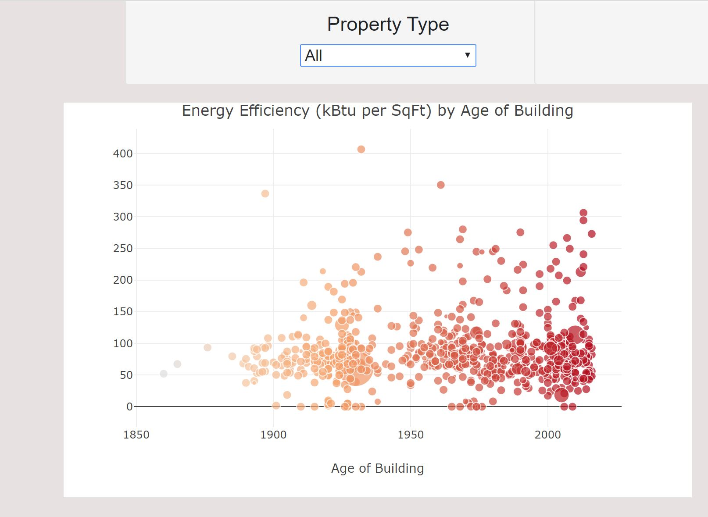

### On a 4-person team, Created Plotly & Leaflet (Markers & Heatmap) visualizations of a 2017 Chicago Buildings' Energy Use json file from Socrata.  Used Python to request the data and SQLAlchemy to store the data in a SQLLite file.  
### Created a Plotly Bubblechart to represent the square foot size of buildings by the size of the bubble.  Added a tooltip to the bubbles to provide the user the building's name and kBTU usage.




```python
res = requests.get("https://data.cityofchicago.org/resource/xq83-jr8c.json").json()
response_df = pd.DataFrame(res)
New_df = response_df[["address","data_year",  "longitude", "latitude","site_eui_kbtu_sq_ft","gross_floor_area_buildings_sq_ft", "electricity_use_kbtu","year_built","property_name", "primary_property_type"]]
New_df_2 = New_df.loc[New_df["data_year"] == "2017"]
import sqlalchemy
from sqlalchemy.ext.automap import automap_base
from sqlalchemy.orm import Session
from sqlalchemy import create_engine, func
engine = create_engine("sqlite:///Resources/hawaii.sqlite")
New_df_2.to_sql(name='hawaii', con=cnx)
pd.read_sql_table(table_name='hawaii', con=e)
import sqlite3
# Create your connection.
# creating a database and creating a table from the dataframe 
cnx = sqlite3.connect('Project2')
New_df_2.to_sql(name='hawaii', con=cnx)
w2 = pd.read_sql_query("SELECT * FROM hawaii" , cnx)
w2.head().T
w2.shape
```
